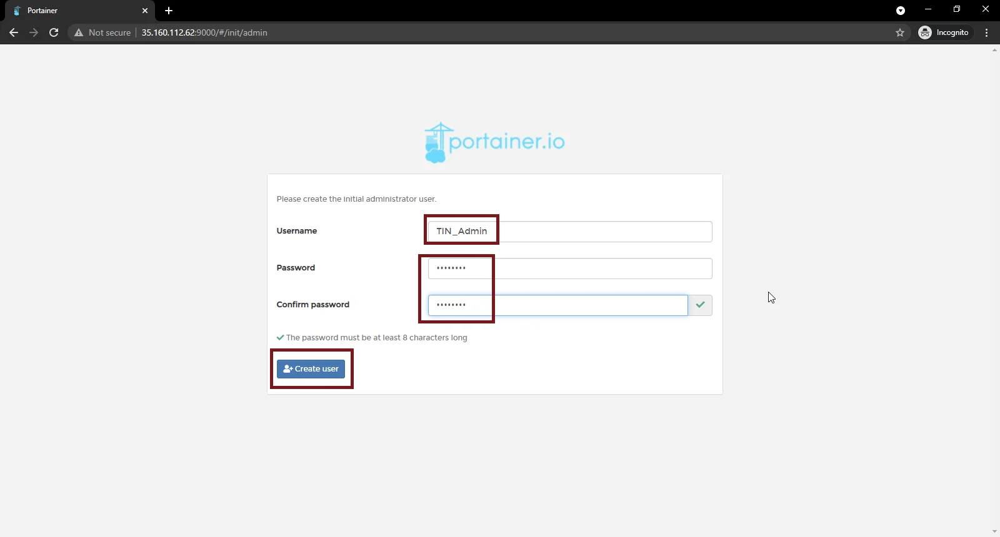
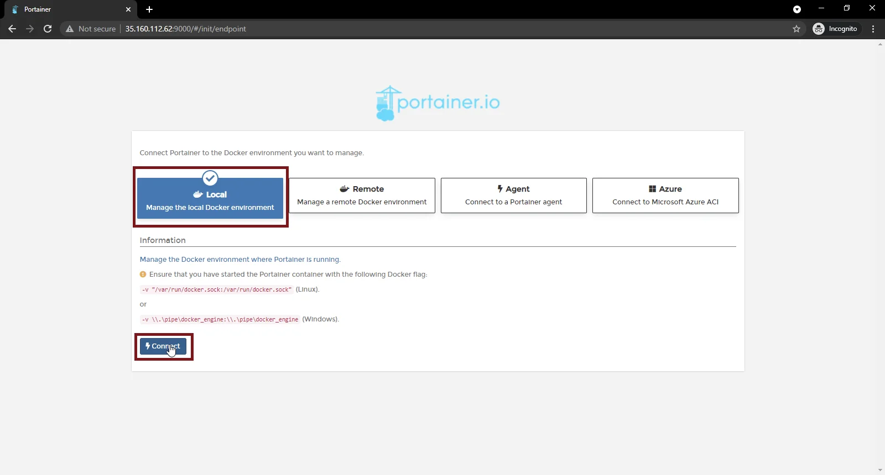
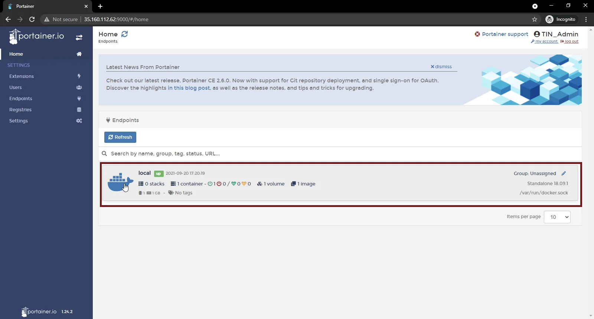

<!-- omit in toc -->
# Configure The Environment: Debian, Docker & Portainer


In this guide we will setup the basic environment to install and host Docker containers on Debian Linux.

<!-- omit in toc -->
## Table of Contents
- [Install Docker](#install-docker)
- [Deploy Portainer](#deploy-portainer)
- [Install UFW](#install-ufw)
- [Configure Portainer](#configure-portainer)

## Install Docker
SSH into your Linux server (or open a direct terminal) to install Docker.
```bash
sudo apt install docker.io
```
Enable the Docker service,
```bash
sudo systemctl enable docker
```
And start it.
```bash
sudo systemctl start docker
```
You can verify Docker is running by checking the version
```bash
docker -v
```

## Deploy Portainer
Now that Docker is installed, we can deploy our Portainer container by pulling the Portainer Image from The Docker Hub repository.

First, create a volume for Portainer data.
```bash
sudo docker volume create portainer_data
```
Pull the Portainer image from the repository and run it with the below command:
```bash
sudo docker run -d -p 9000:9000 --name portainer --restart always -v /var/run/docker.sock:/var/run/docker.sock -v portainer_data:/data portainer/portainer
```
To verify that Portainer is setup successfully and is running, use the docker ps command to view your docker services’ status.
```bash
sudo docker ps
```

## Install UFW
Now that Portainer is up and running, our next step is to setup our firewall and open the ports we need for our services.

> Note: You don’t need to follow this part if your VPS has a firewall configured for your instances by default from your hosting provider, but you have to allow these ports from the Instance Management Console as you do for SSH.

For our Debian firewall, we will manage it using UFW, you can install it with the below command.
```bash
sudo apt install ufw
```
Now you need to configure the firewall to allow the ports we use to access and manage our services before you turn it on. Currently we need to allow ssh (port 22) and port 9000 for Portainer.
```bash
sudo ufw allow 22,9000/tcp
```
Finally, enable the firewall.
```bash
sudo ufw enable
```
Now you can access Portainer using the IP address of your Debian instance through port 9000.

## Configure Portainer
Open your web browser and navigate to **YOUR HOST IP**:9000. You will be asked to create your Portainer administrator account. Enter the credentials you want and click “Create user”.



Once you have created the administrator account, you will be asked to connect Portainer to a Docker environment, select the local Docker environment and click “Connect”.



After which you should be forwarded to your Portainer Home screen as below, and you can verify that Portainer is successfully connected to Docker if you see the local endpoint status as “Up”.



With that we have successfully completed our basic environment setup and are ready to deploy our applications as Docker containers. You can continue by following any of the Docker service setup guides to install and configure your selected service.
