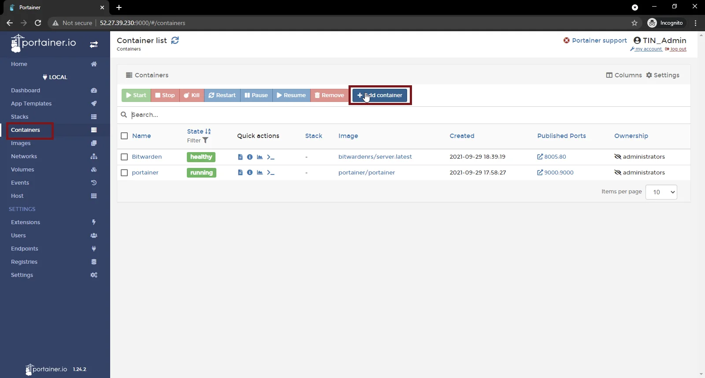
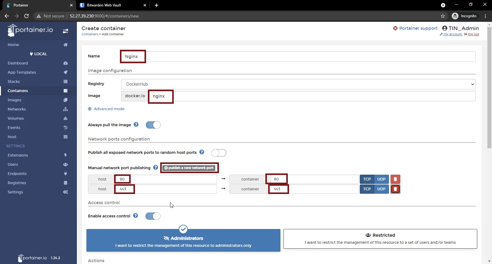
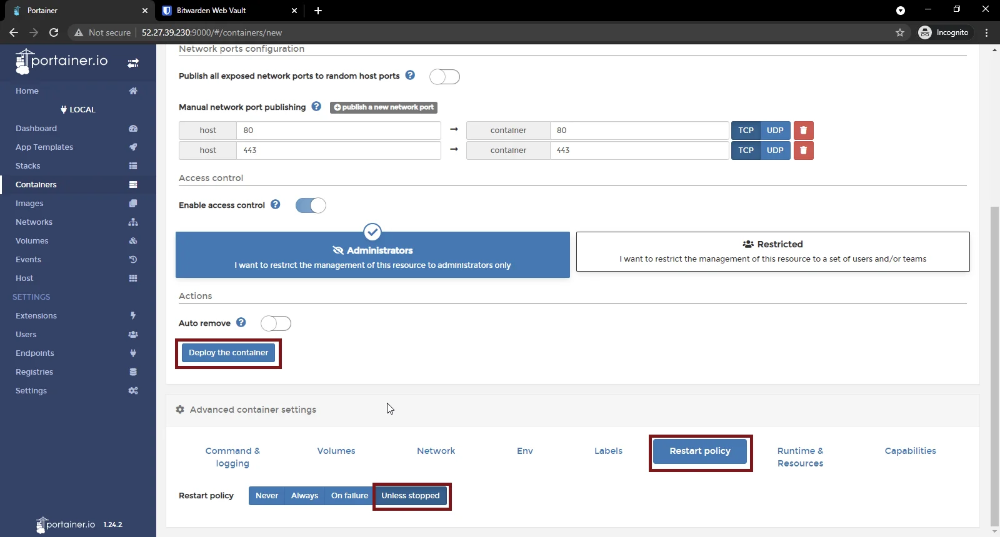
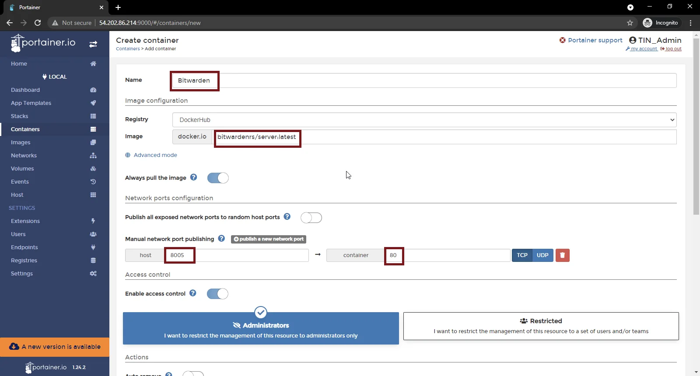
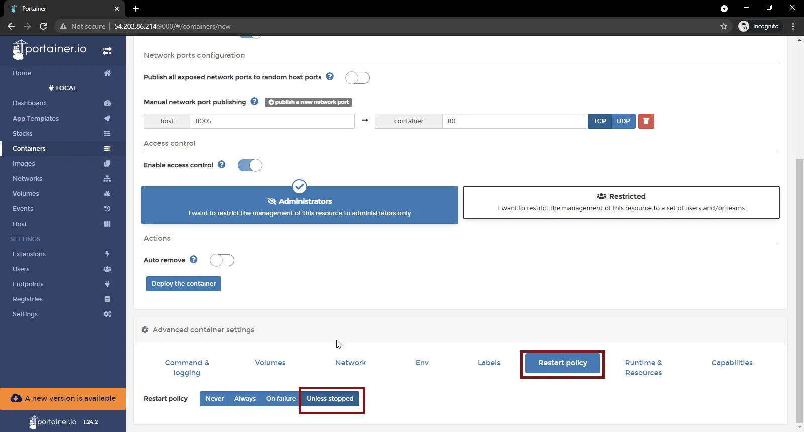
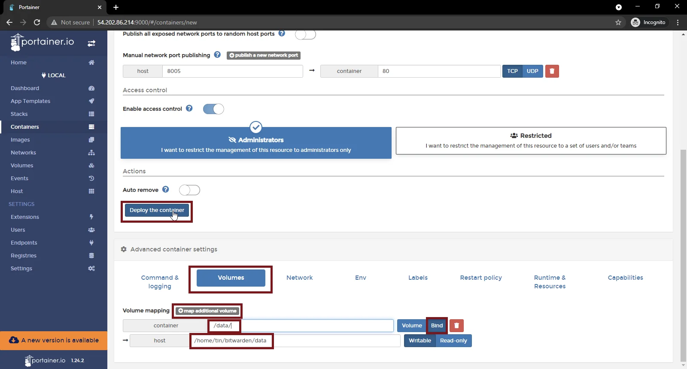
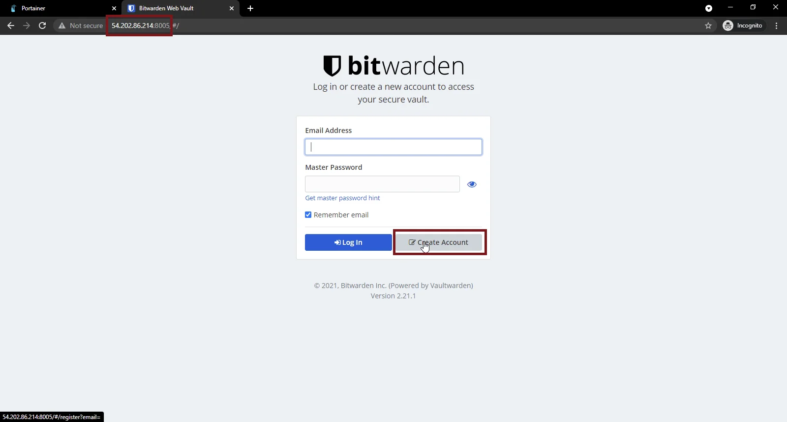

<!-- omit in toc -->
# Deploy BitWarden on Docker

<br/>

This guide demonstrates the process of installing and configuring a BitWarden server on Docker via Portainer. If you do not have your server running Docker/Portainer yet, please refer to the guide [Configure The Environment: Debian, Docker & Portainer](/ConfigureTheEnvironment/ConfigureTheEnvironment.md).

<!-- omit in toc -->
## Table of Contents
- [Configure UFW](#configure-ufw)
- [Implement HTTPS](#implement-https)
  - [Deploy \& Configure Nginx](#deploy--configure-nginx)
  - [Install Certbot](#install-certbot)
- [Deploy Bitwarden](#deploy-bitwarden)


## Configure UFW

First we will open the ports in our firewall which our Bitwarden and Nginx containers will need to be accessible. To do that, ssh into your host and run the following command:
```bash
sudo ufw allow 80,443,8005/tcp
```

## Implement HTTPS

Bitwarden requires HTTPS to work, so before we deploy an Nginx container, we need to install certbot and generate our own SSL certificate to secure the connections to our host, and to do that we need a web server, we will go with Nginx for that.

>Note: In order to generate an SSL certificate, you need an active domain name with an A record pointing to your host’s IP address.

### Deploy & Configure Nginx

To configure your Nginx container, navigate to your Portainer web console at **YOUR HOST IP**:9000 and login with your admin account. From the side menu, click on “Containers”, and there click on “Add container”
<br/><br/>

<br/><br/>

Enter the details for the Nginx container as below:
```
Name: Nginx
Image: nginx
```

Click on “Publish a new network port” and enter the port details as below:
```
Host: 80        Container: 80
Host: 443       Container: 443
```


<br/><br/>

Scroll to the bottom of the page, under “Advanced container settings”, click the “Restart Policy” and change it to “Unless Stopped”. Then click on “Deploy the container”.
<br/><br/>

<br/><br/>

Once the container has been deployed, ssh into your host and run below command to find the container ID of Nginx.
```bash
sudo docker ps
```

Copy your Nginx container ID, and paste it into the below command to connect to your Nginx bash shell as below:
```bash
sudo docker exec -it YOUR CONTAINER ID bash
```

In the container shell, run the below command to install nano:
```bash
apt update && apt install nano
```

Next we can create and modify the needed Nginx config file by running below command:
```bash
nano /etc/nginx/conf.d/bitwarden.conf
```

Copy the below configuration into the file and save it by pressing ctrl+o. Make sure to use your domain name under server_name variable and your host IP under the proxy_pass variable.
```
server {
    listen       80;
    server_name  bitwarden.YOURDOMAINNAME.HERE;

location / {
    proxy_pass       http://YOUR HOST IP:8005;
    proxy_http_version         1.1;
    proxy_read_timeout 300;
    proxy_set_header Upgrade $http_upgrade;
    proxy_set_header Connection "upgrade";
    proxy_set_header Host $http_host;
    proxy_set_header X-Real-IP $remote_addr;
    proxy_set_header X-Real-PORT $remote_port;
           }
}
```

Restart the Nginx service
```bash
service nginx restart
```

### Install Certbot
Next we are going to install Certbot, which we will use to issue our Letsencrypt SSL certificate
```bash
apt install certbot python-certbot-nginx
```

Once Certbot has been installed, run below command to issue the certificate.
```bash
certbot --nginx
```

Certbot will require some inputs, which you can provide as below:
```
Email: YOUR EMAIL

Terms of Service: A (Agree)

Share Email: N (No)

Activate HTTPS for: 1 (YOUR DOMAIN NAME)

Enable Redirection: 2 (Redirect)
```

Once done, your Nginx server would be running HTTPS with the SSL you just issued for your Bitwarden. You can test your SSL connection using SSLLabs:

https://www.ssllabs.com/ssltest/analyze.html?d=bitwarden.YOURDOMAINNAME.HERE

## Deploy Bitwarden

Navigate to your Portainer web console at **YOUR HOST IP**:9000 and login with your admin account. From the side menu, click on “Containers”, and there click on “Add container”
<br/><br/>

<br/><br/>

Enter the basic details for the container as below:
```
Name: Bitwarden
Image: bitwardenrs/server
```

Click on “Publish a new network port” and enter the port details as below:
```
Host: 8005      Container: 80
```


<br/><br/>

Now scroll to the bottom of the page, under “Advanced container settings”, click the “Restart Policy” and change it to “Unless Stopped”.
<br/><br/>

<br/><br/>

Before we deploy the container, we need to map its persistent volumes, to do that, under “Advanced container settings”, click the “Volumes” tab, and map the volumes as below:
```
Container: /data/ 
    Host: /home/YOUR USERNAME/bitwarden/data/
```
Finally click on “Deploy the container”.
<br/><br/>

<br/><br/>

Once the container is deployed and running, open your browser and navigate to ***YOUR HOST IP***:8005. You will be greeted with the BitWarden login page, click “Create Account” to create your admin account. With that you have successfully deployed your Bitwarden instance.
<br/><br/>

<br/><br/>