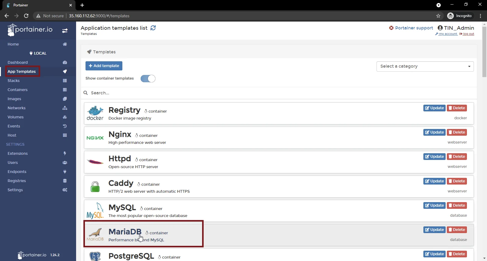
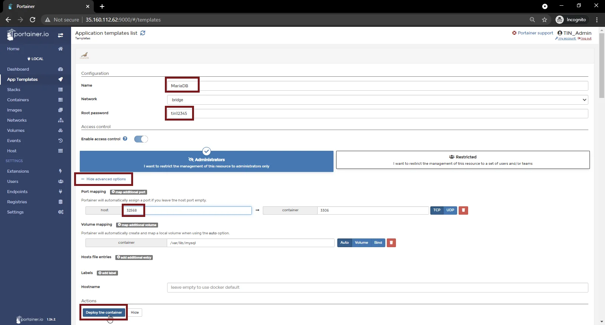
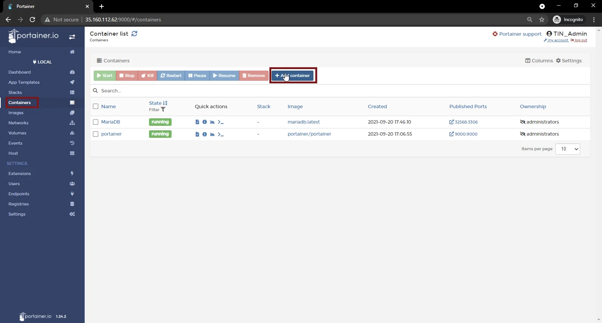
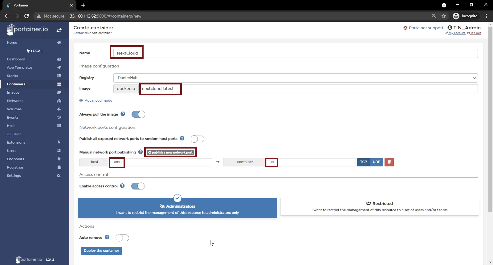
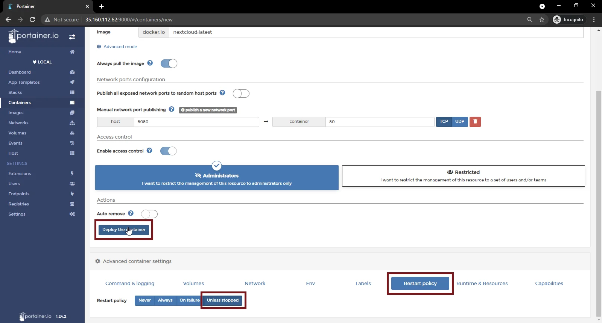
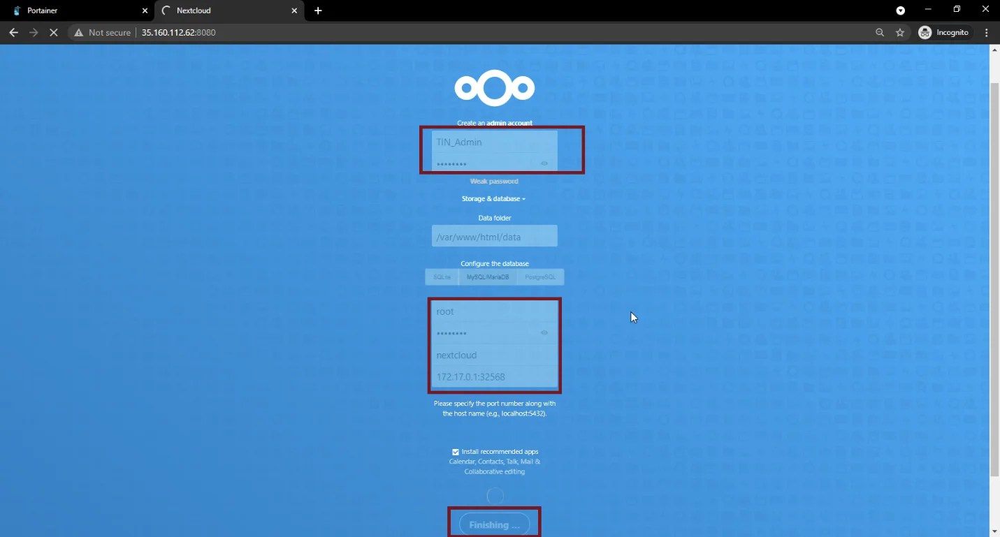
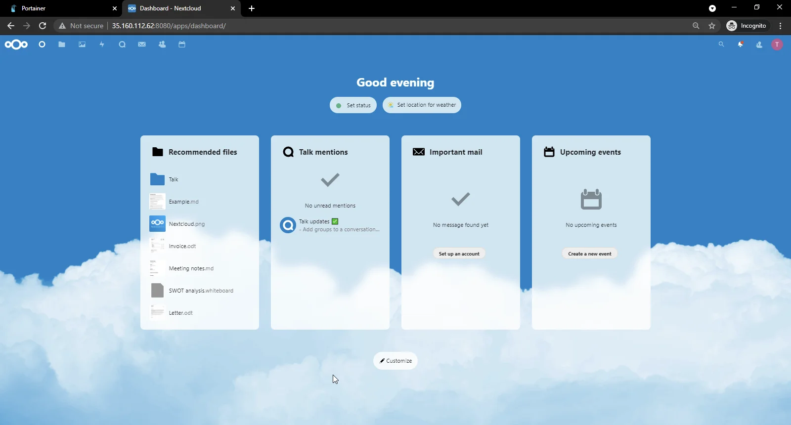

<!-- omit in toc -->
# Deploy NextCloud on Docker


This guide demonstrates the steps to install and configure your NextCloud instance on Docker using Portainer UI. If you did not setup your server and install Docker/Portainer yet, Please refer to the guide [Configure The Environment: Debian, Docker and Portainer](/ConfigureTheEnvironment/ConfigureTheEnvironment.md).

To deploy NextCloud on Docker using Portainer, we first need a database container. NextCloud recommends MySQL or MariaDB, so we will deploy a MariaDB container and then we can deploy our NextCloud container.

<!-- omit in toc -->
## Table of Contents
- [Deploy MariaDB](#deploy-mariadb)
- [Deploy NextCloud](#deploy-nextcloud)
- [Configure UFW](#configure-ufw)
- [Configure NextCloud](#configure-nextcloud)

## Deploy MariaDB
Login to Portainer via your web browser and on the side menu, click “App Templates”, then under “Templates”, select “MariaDB”.



For the container configuration, provide the below details, then click on “Deploy the container”.
```
Name: MariaDB
Root Password: A STRONG DATABASE ROOT PASSWORD
```
Then click “Show advanced options“, and under “Port mapping”, set your host port to 32568 then click "Deploy the container".



## Deploy NextCloud
To deploy NextCloud, select “Containers” from the side menu, and click on “Add container”.



Provide the details for the container as below, while leaving the default values for other fields which are not specified below.
```
Name: NextCloud
Image: nextcloud:latest
```
Click on “Publish a new network port” and add these port details.
```
Host: 8080          Container: 80
```


Now scroll to the bottom of the page, under “Advanced container settings”, click the “Restart Policy” and change it to “Unless Stopped”, then click on “Deploy the container”.




## Configure UFW
We need to open the port in our firewall from which our NextCloud container will be accessed. To do that, ssh into your host and run the following command:
```bash
sudo ufw allow 8080/tcp
```

## Configure NextCloud
Now that your NextCloud instance is deployed, you need to configure its admin account and database connectivity. In your web browser, navigate to **YOUR HOST IP**:8080 and enter the admin account and database details as below, then click on “Finish”.
```
User: YOUR ADMIN NAME
Password: YOUR STRONG ADMIN PASSWORD
```
Click “Storage & database“, Under “Configure the database”, select “MySQL/MariaDB” and enter your database details:
```
User: root
Password: YOUR STRONG DATABASE ROOT PASSWORD
Database: nextcloud
Host: YOUR DB CONTAINER INTERNAL IP:3306
```


That’s it! Your NextCloud instance is now live and accessible through the browser on **YOUR HOST IP**:8080.

