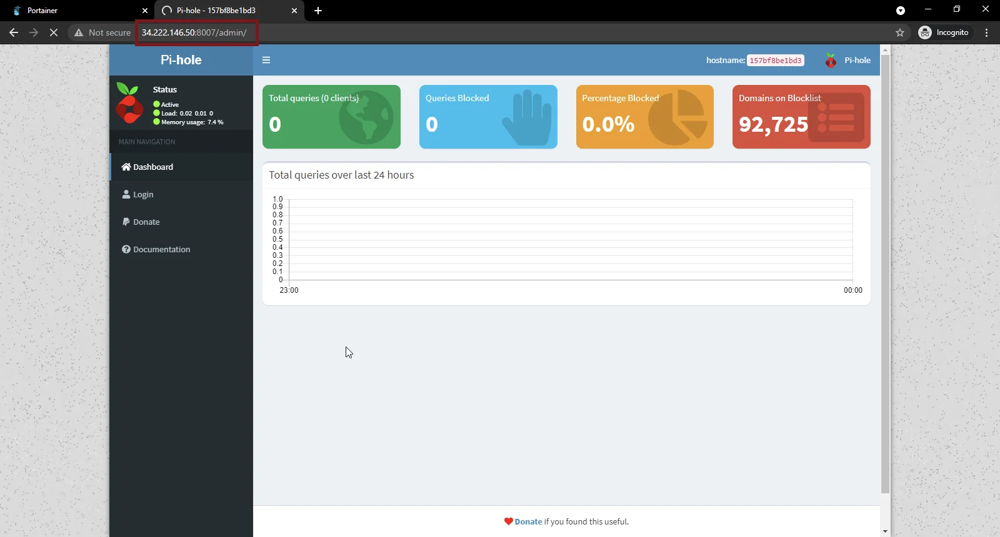

<!-- omit in toc -->
# Deploy Pi-Hole on Docker

<br/>

This guide demonstrates the process of installing and configuring a Pi-Hole server on Docker via Portainer. If you do not have your server running Docker/Portainer yet, please refer to the guide to [Configure The Environment: Debian, Docker & Portainer](/ConfigureTheEnvironment/ConfigureTheEnvironment.md).

<!-- omit in toc -->
## Table of Contents
- [Configure UFW](#configure-ufw)
- [Deploy Pi-Hole](#deploy-pi-hole)

## Configure UFW

First we will open the ports in our firewall which our Pi-Hole container will need to be accessible. To do that, ssh into your host and run the following command:
```bash
sudo ufw allow 80,53,67,8007/tcp
```

## Deploy Pi-Hole

Navigate to your Portainer web console at **YOUR HOST IP**:9000 and login with your admin account. From the side menu, click on “Containers”, and there click on “Add container”
<br/><br/>

<br/><br/>

Enter the basic details for the container as below:
```
Name: Pi-Hole
Image: pihole/pihole:latest
```
Click on “Publish a new network port” and enter the port details as below:
```
Host: 8007      Container: 80
Host: 53        Container: 53
Host: 53        Container: 53   “UDP”
Host: 67        Container: 67   “UDP”
```

<br/><br/>

Scroll to the bottom of the page, under “Advanced container settings”, click the “Restart Policy” and change it to “Unless Stopped”.

Now before we deploy the container, we need to map its persistent volumes, to do that, still at the bottom of the page, click the “Volumes” tab, and map the volumes as below:
```
Container: /etc/pihole/
    Host: /home/YOUR USERNAME/pihole/etc/

Container: /etc/dnsmasq.d
    Host: /home/YOUR USERNAME/pihole/dnsmasq/
```


<br/><br/>

After configuring the volumes, click the “Env” tab, and add the below two environment variables:
```
Name: TZ            Value: YOUR TIMEZONE HERE
Name: WEBPASSWORD   Value: YOUR STRONG WEB PASSWORD HERE
```

Finally click on “Deploy the container”.
<br/><br/>

<br/><br/>

Once the container is deployed and running, open your browser and navigate to **YOUR HOST IP**:8007/admin, you will be greeted by your PiHole admin page. With that you have successfully deployed your Pi-Hole instance.
<br/><br/>

<br/><br/>