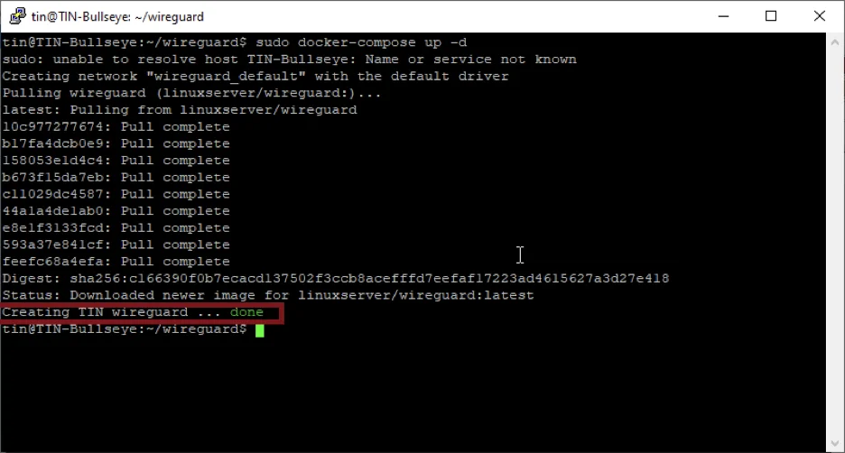

<!-- omit in toc -->
# Deploy WireGuard on Docker


This guide demonstrates the process of installing and configuring a WireGuard server on Docker via Docker Compose. If you do not have your server running Docker yet, please refer to the guide [Configure The Environment: Debian, Docker & Portainer](/ConfigureTheEnvironment/ConfigureTheEnvironment.md).

<!-- omit in toc -->
## Table of Contents
- [Install Docker Compose](#install-docker-compose)
- [Configure UFW](#configure-ufw)
- [Create The Compose File](#create-the-compose-file)
- [Deploy WireGuard](#deploy-wireguard)

## Install Docker Compose
We will deploy WireGuard using Docker Compose. First we need to download Compose:
```bash
sudo curl -L "https://github.com/docker/compose/releases/download/1.29.2/docker-compose-$(uname -s)-$(uname -m)" -o /usr/local/bin/docker-compose
```
Allow it as exceutable and create a link for the file
```bash
sudo chmod +x /usr/local/bin/docker-compose
sudo ln -s /usr/local/bin/docker-compose /usr/bin/docker-compose
```
To verify that the docker-compose command works, you can get the compose version
```bash
docker-compose -v
```

## Configure UFW
We will open the port in our firewall which our WireGuard container will need to be accessible. To do that, ssh into your host and run the following command:
```bash
sudo ufw allow 51820/tcp
```

## Create The Compose File
Now we will create the compose yml file which will define our WireGuard container configuration. To do that, we will create a directory for our WireGuard files and will create the docker-compose.yml within it.
```bash
mkdir wireguard
cd wireguard
sudo nano docker-compose.yml
```

Now paste the below configuration into the yml file in nano editor. Remember to replace the **YOUR HOST IP** below with your own host IP address (or domain name), and to set the TZ variable to your timezone, then save the file by pressing ctrl+o.
```
version: "2.1"
services:
  wireguard:
    image: linuxserver/wireguard
    container_name: wireguard
    cap_add:
      - NET_ADMIN
      - SYS_MODULE
    environment:
      - PUID=1000
      - PGID=1000
      - TZ=Europe/London
      - SERVERURL= 54.202.98.198  #optional
      - SERVERPORT=51820 #optional
      - PEERS=1 #optional
      - PEERDNS=auto #optional
      - INTERNAL_SUBNET=10.13.13.0 #optional
    volumes:
      - /opt/wireguard-server/config:/config
      - /lib/modules:/lib/modules
    ports:
      - 51820:51820/udp
    sysctls:
      - net.ipv4.conf.all.src_valid_mark=1
    restart: unless-stopped
```

## Deploy WireGuard
Now you can run the below compose command to pull the wireguard image from repo and run the container from that image. Make sure to be in same directory where we created the docker-compose.yml file.
```bash
sudo docker-compose up -d
```


You should see the container creation confirmation message. With that your WireGuard container is up and running.